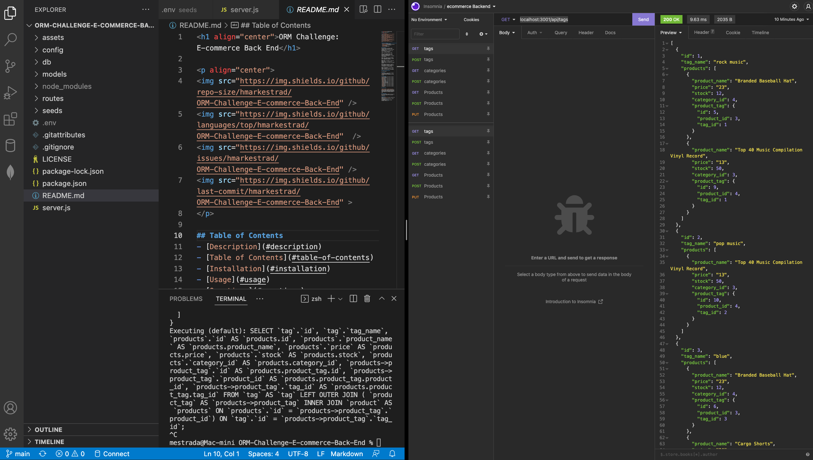

<h1 align="center">ORM Challenge: E-commerce Back End</h1>

  
## Table of Contents
- [Description](#description)
- [Table of Contents](#table-of-contents)
- [Installation](#installation)
- [Usage](#usage)
- [Questions](#questions)
  
## Description
AS A manager at an internet retail company  I WANT a back end for my e-commerce website that uses the latest technologies
SO THAT my company can compete with other e-commerce companies.  
  
GIVEN a functional Express.js API  
  
WHEN I add my database name, MySQL username, and MySQL password to an environment variable file  
THEN I am able to connect to a database using Sequelize  
  
WHEN I enter schema and seed commands  
THEN a development database is created and is seeded with test data  
  
WHEN I enter the command to invoke the application  
THEN my server is started and the Sequelize models are synced to the MySQL database  
  
WHEN I open API GET routes in Insomnia for categories, products, or tags  
THEN the data for each of these routes is displayed in a formatted JSON  
  
WHEN I test API POST, PUT, and DELETE routes in Insomnia  
THEN I am able to successfully create, update, and delete data in my database  
  
## Credits & Contributions
H. Mark Estrada
  
## License
 
This application is covered by the MIT license. 
  
## Technologies

  
## Screen Shot

  
## Installation
Run the following command at the root of your project: `npm init` | `npm start` 
  
## Questions
GitHub: [hmarkestrad](https://github.com/hmarkestrad) 
Contact me with any questions: h.mark.estrada@gmail.com 
Copyright 2022 © H. Mark Estrada. AllRights Reserved. 
